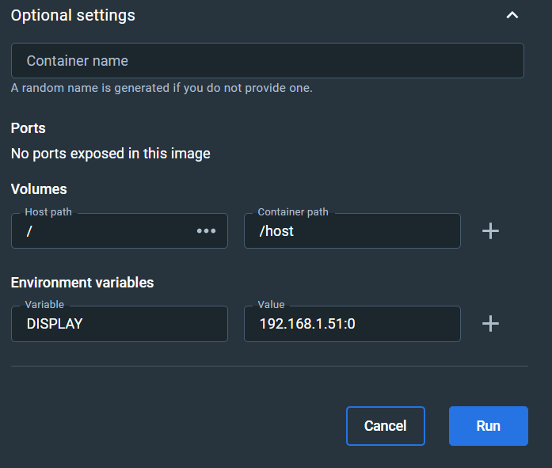
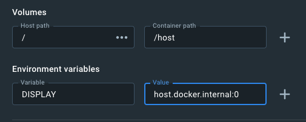

# rawtherapee-dev
This repo can build an image of rawtherapee-dev and push it to the Github Container Registry.

How to download the docker image:
```
$ docker pull ghcr.io/kd6kxr/rawtherapee_docker-image:latest
```

To Run in Docker Desktop:

## Windows:
Pre-requisite: Install the X11 Window System: [Xming](http://www.straightrunning.com/XmingNotes/)

1. 
2. Select the image in the Images tab and click *Run*.

#### Note: replace with your IPv4 address in the Environment Value field, followed by `:0` (colon zero).

## On MacOS:
Pre-requisite: Install the X11 Window System: [XQuartz](https://www.xquartz.org)
1. Use terminal app to launch an xterm window: `/opt/X11/bin/xterm`
2. In the xterm window:
```
xhost +localhost
/opt/X11/bin/Xquartz -depth 24-1 :0 -listen tcp &
```
3. Launch the image using the host display value indicated here:


#### Note: opening the Xquartz tcp listener in xterm results in an optimum-sized RawTherapee window.
